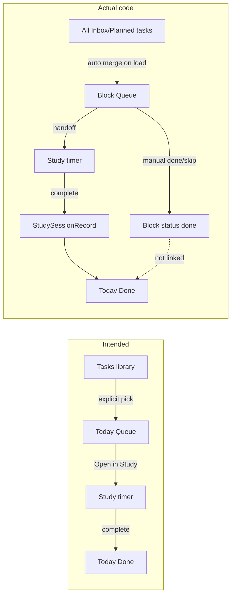

# Iris Daily Hub Actionability & UI Audit

**Date:** 2026-07-12  
**Scope:** Read-only inspection of `/Users/iristong/Documents/Codex/iris-daily-plan`  
**Goal:** Decide what to simplify so the app becomes easier to start, clearer to use, more actionable, more visually rewarding, and better aligned with daily habits.

---

## Executive summary

Iris Daily Plan Hub has **strong underlying intent** — especially the recent “single timer in Study, Today as focus screen, sessions as evidence” direction — but the **live product still behaves like three apps stitched together**:

1. **Action layer (good direction):** Today Start → Study timer → `StudySessionRecord` → Today Done  
2. **Planning layer (still heavy):** Block Queue, AI plan, check-in, carry-over, ranked tasks  
3. **Legacy layer (hidden but alive):** Pomodoro, Focus Blocks, Focus Garden, Start Now records, rescue timers, `taskStore` mirror

**The biggest usability gap is not visual polish — it is mental-model drift:**

| Intended model | What code actually does |
|---|---|
| Tasks = master library | ✅ `iris-tasks` is canonical for inbox |
| Today Queue = today’s *selected* menu | ❌ Queue auto-merges **all** `Inbox`/`Planned` active tasks every load |
| Study Session = completed timed work | ✅ Mostly true (`iris-study-session-records`) |
| Today Done = visible evidence | ✅ Study sessions + exercise only (by design) |
| One active session | ⚠️ Enforced for study, but 4 timer engine keys + Pomodoro + Focus Block workflow still exist |
| Queue completion ↔ session completion | ❌ Completing a study session does **not** mark the queue block done |

**When you open the app tired, the path is:**

Today → pick Study / English / Exercise → often **navigate again** → pick task again → pick 25/50/custom → start → complete on Today (not Study).

That is **4–6 decisions** before momentum, with duplicate “Start/Open” affordances on Today, Plan, Study, Tasks, and header.

**Recommended north star (already partially built):**

```
Tasks (library) → Today Queue (picked menu) → Study (one timer) → Today Done (evidence) → Iris365 (momentum)
```

Phase A should fix **queue semantics**, **start-path clarity**, and **completion feedback loops** — not another visual redesign.

---

## Current mental model

### Your stated product principle

```
Tasks          = master task library
Today Queue    = today's selected menu from Tasks
Study Session  = actual timed work (only completed sessions count)
Active Session = current in-progress work (one at a time)
Today Done     = visible completed evidence
Iris365        = long-term momentum
```

### What the UI *claims*

- **Today:** “Start a small block” — Study / English / Exercise cards, Next card, collapsible Done/Queue/Note  
- **Plan / Queue copy:** “Plan decides what to do; Study runs the timer” (`BlockQueueView`, `HomeCommandCentre`)  
- **Study:** “Study runs the timer” — handoff from queue, 25/50/custom Start buttons  
- **Tasks:** “Pomodoro sessions are separate from Study Sessions” (`TaskInbox`)  
- **Today Done helper:** “Only completed focus sessions count” (`HomeCommandCentre`)

### What the UI *actually trains*

- Every pending inbox task appears in Today Queue automatically  
- “Open in Study” is not “Start” — it is navigation + another Start decision  
- Queue block “done” and study session “completed” are **different currencies**  
- Two Iris365 systems (`iris-365` full program vs `iris-365-log` momentum day on Today)  
- Integrations tab is named like an AI assistant but is really **ops/import**  
- Low-energy Start Plan + Pomodoro rescue timers still live under Today collapsibles

---

## Actual code/data model discovered

### Architecture

| Layer | Technology |
|---|---|
| App shell | React 19 + Vite + TypeScript SPA (`src/main.tsx` → `src/App.tsx`) |
| Routing | **None** — tab state `useState<Tab>` in `App.tsx` |
| Persistence | `localStorage` (+ `sessionStorage` for handoffs) |
| Backend | Vercel serverless `api/` (Gemini, Google, Notion) |

### Main tabs → components

| Tab | Primary component(s) | Key files |
|---|---|---|
| Today | `TodayCommandCentre` → `HomeCommandCentre` → `StartNowDashboard` | `App.tsx`, `HomeCommandCentre.tsx`, `StartNowDashboard.tsx` |
| Iris 365 | `Iris365` | `Iris365.tsx`, `iris365Storage.ts` |
| Study | `StudyDashboard` | `StudyDashboard.tsx`, `studyStorage.ts`, `studyTaskLibrary.ts` |
| Plan | `PlanWorkspace` → `BlockQueueView` + `DailyPlanView` | `App.tsx`, `BlockQueueView.tsx`, `DailyPlanView.tsx`, `planner.ts` |
| Tasks | `TaskWorkspace` → `TaskInbox` / `RecurringTemplates` | `App.tsx`, `TaskInbox.tsx`, `taskStore.ts` |
| Exercise | `ExerciseTab` | `ExerciseTab.tsx`, `exerciseStorage.ts` |
| Media | `MediaTab` | `MediaTab.tsx`, `mediaLogStorage.ts` |
| Integrations | `AIAssistant` | `AIAssistant.tsx`, `expressionHubImport.ts`, services |
| Settings | `Settings` (gear menu) | `Settings.tsx` |

### Session / timer stack (parallel layers)

```
┌─────────────────────────────────────────────────────────────┐
│ UI: Today active hero (StartNowDashboard)                     │
│     Study compact banner → "Return to session"              │
│     App header compact bar (non-Today tabs)                   │
└───────────────────────────┬─────────────────────────────────┘
                            │
┌───────────────────────────▼─────────────────────────────────┐
│ iris-study-active-session  (StudyActiveSession)               │
│ iris-study-timer-engine-active  (timerEngine, engine=study)   │
│ iris-active-session  (unified banner metadata)                │
└───────────────────────────┬─────────────────────────────────┘
                            │ complete/abandon
┌───────────────────────────▼─────────────────────────────────┐
│ iris-study-session-records  (StudySessionRecord) ← Today Done │
│ iris-task-store.sessions  (mirror only)                       │
└─────────────────────────────────────────────────────────────┘

Legacy parallel engines (still in code/storage):
  iris-pomodoro-timer-engine-active
  iris-focus-block-timer-engine-active
  iris-focus-sessions (Focus Garden)
  iris-start-now-records
```

### Canonical vs mirror data

| Domain | Source of truth (UI reads) | Mirror / parallel |
|---|---|---|
| Task Inbox | `iris-tasks` | `iris-task-store.tasks` |
| Today Queue | `iris-block-queues-by-date` | merged from all active tasks; quick-add mirrors to taskStore |
| Study sessions | `iris-study-session-records` | `iris-task-store.sessions` |
| Active study timer | `iris-study-active-session` + timer key | `iris-active-session`, taskStore.activeTimer |
| Today Done | completed study sessions + exercise log | **not** queue status, **not** Pomodoro, **not** start-now records |
| English reps | `iris-english-output-journey` | also fed by expression hub imports |
| Iris365 proof | `iris-365` | optional prompt after study complete |

### Queue implementation detail

- **Load path:** `loadDayBlockQueue()` → `mergeQueueWithTasks(existing, loadActiveTasks())`  
- **Active tasks:** `isActiveTask()` = not done AND status in `['Inbox', 'Planned']` (`focusBlocks.ts`)  
- **Implication:** Adding any inbox task **automatically adds it to today's queue** on next load — there is no explicit “add to today” flag on Task Inbox (except external import and quick-add templates in Today queue panel).

### Dead / unwired code still present

| Item | Status |
|---|---|
| `startStudySessionFromQueueBlock()` in `blockQueueStudySession.ts` | **Never imported** — dead direct-start path |
| `FocusBlockWorkflow` in `App.tsx` | Defined, not mounted in nav |
| `StartSessionsPage.tsx`, `VisibleEffort.tsx`, `ComfortLibrary.tsx` | Not wired to main nav |
| `Iris365MomentumTab.tsx` | Not in nav; day number pulled into Today via `IRIS365_MOMENTUM_START_DATE` |
| Focus Garden / Pomodoro UI | Hidden via CSS in `index.css`, still callable from Tasks/Low-energy |

---

## Main usability problems

### 1. Too many “start” verbs that mean different things

| Label | Actual behavior |
|---|---|
| Today **Study** card | Navigate to Study OR handoff queue block (no timer) |
| Today **Next → Open in Study** | Handoff only |
| Plan/Queue **Open in Study** | sessionStorage handoff |
| Study **Start 25/50/custom** | Actually starts timer ✅ |
| Task Inbox **Start Pomodoro** | Separate legacy timer → `iris-focus-sessions` |
| Low-energy **Start 5/15-min rescue timer** | Pomodoro on Start Plan |
| Recurring Templates **Start** | Creates Focus Block (`focusBlocksByDate`) |
| English Draw **Start as Study Session** | Starts timer ✅ |

**User impact:** “Start” sometimes means navigate, sometimes means timer, sometimes means mark-intent-only.

### 2. Today Queue ≠ “selected menu”

UI copy says queue is “today’s menu,” but code merges **every** pending inbox/planned task. A large backlog becomes a **guilt wall** hidden behind the Queue chip.

### 3. Queue progress ≠ real progress

- `queueOverview().completedBlocks` counts blocks marked `done` (including “Done without timer”)  
- `completedFocusMinutes` is **hardcoded 0** in `blockQueue.ts`  
- Today Done ignores queue entirely  
- Completing a timed study session from a queue task **does not** update block status

Result: two competing “done” concepts on the same screen family.

### 4. Study is long before action

Opening Study when tired shows (in order): target hero, Coursera card, course plan, English Output Journey, English Listening Draw, timer section, task library, custom task, study review, Notion push — **before** the user has finished one block.

When a session *is* active, Study hides the full timer and says “Return to session” (Today).

### 5. Today is visually rich but action-buried

Above the fold: hero image editor, Start cards, progress strip, Next card, module chips.  
Below: entire queue (only if Queue expanded), plus **four collapsed `<details>` panels**: embedded plan, low-energy mode, admin reminders, sync & refresh, full check-in.

### 6. Navigation drift vs internal docs

`navigation_final_structure_notes.md` describes Tasks under Plan and no top-level Iris365 — **current `App.tsx` has 8 top-level tabs** including Tasks and Iris 365.

### 7. Legacy systems still affect behavior

- Pomodoro in Task Inbox (CSS-hidden badges may still confuse devtools/CSS overrides)  
- `quickStartStudySync.ts` bridges deprecated start-now records → study sessions  
- `DailyPlanView` can still start focus blocks  
- `taskStore` migration runs but UI mostly ignores unified store

### 8. Weak completion → momentum loop

After completing a session:
- ✅ Today Done updates (if on Today / refresh)  
- ✅ English reps increment for English Output category  
- ⚠️ Optional Iris365 proof prompt (easy to skip)  
- ❌ Queue block stays open  
- ❌ No “what moved forward today” summary strip  
- ❌ Iris365 tab not surfaced on completion

---

## Page-by-page audit

### Today

**A. Page job:** Get you into one small block, show active session, show evidence of what you finished.

**B. First action should be:** Continue active session OR Start Study on next queue item.

**C. Is it obvious?** **Partially.** Active session hero is excellent when running. Idle state competes: hero photo edit, three equal Start cards, Next card, collapsed modules.

**D. Hide / collapse / move:**
- Hero image editor → Settings or long-press only  
- Low-energy Start Plan + Pomodoro rescue → merge into one “Stuck? 5 min reset” or move to Study/Settings  
- Full queue panel → summary + “Manage queue” link to Plan  
- Embedded plan generator → Plan tab only (already optional via `fullCommandHubMode`)  
- Sync & refresh / check-in → first-run or weekly, not daily default

**E. Duplicated elsewhere:**
- Queue UI duplicates Plan (`BlockQueueView`)  
- Active timer duplicates Study (intentionally — Study sends you back)  
- Iris365 day pill duplicates Iris365 tab  
- Admin bills/work duplicates collapsible managers (also in data elsewhere)

**F. Should be more visual:**
- Today Done should be **always visible** (not behind chip) — even 2–3 session chips  
- Queue summary: “2/5 touched · 75 study min” not block counts  
- Weekly micro-bar (study min / english reps / movement)

**Actionability classification:**

| Element | Class |
|---|---|
| Active session hero | ✅ Actionable now |
| Start Study / English / Exercise | ✅ Actionable (navigate) |
| Next → Open in Study | ⚠️ Actionable but 2-step |
| Progress strip | Useful reference |
| Done module (collapsed) | Should be default-visible evidence |
| Queue module | Useful but too heavy inline |
| Note module | Nice reference |
| Low-energy / Pomodoro | Legacy / distracting |
| Sync & check-in details | Planning, not start |

**Tired-user verdict:** *Moderate.* Good when session active; idle state still asks you to choose among many equal doors.

---

### Iris365

**A. Page job:** Long-horizon momentum, foundation + proof, monthly phase — **not** daily task management.

**B. First action:** Check today’s foundation toggles OR log one proof item.

**C. Obvious?** **No for daily use.** Large multi-section program UI (~1700 lines). High cognitive load vs “one real thing done today.”

**D. Hide / move:**
- Weekly/monthly review sections → collapse by default except on review days  
- Skill roadmap → reference doc, not daily  
- Dopamine swap tooling → separate “tools” sub-area

**E. Duplicated:**
- Separate from `iris-365-log` / momentum day on Today  
- Study proof prompt writes here but tab isn’t linked post-session  
- Exercise “body moved” overlaps foundation checkbox

**F. More visual:**
- 365-day strip with filled dots (valid days)  
- Current month theme card (already in momentum storage)  
- “This week: X foundation days” not 8 stat tiles

**Tired-user verdict:** *Poor for action.* Better as weekly ritual than mid-day tab.

---

### Study

**A. Page job:** Pick learning target, start **the** timer, English draw/output, review completed sessions.

**B. First action:** If handoff exists → Start 25. Else pick task → Start 25.

**C. Obvious?** **Timer yes, page layout no.** Timer section is below Coursera, English Journey, Listening Draw. Active session redirects to Today.

**D. Hide / collapse:**
- Coursera scholarship card → pin only if inactive >7 days  
- Suggested course plan → collapse  
- Notion push → Integrations  
- Study review form → end-of-day section or Today Done detail

**E. Duplicated:**
- Start buttons (25/50/custom) + English draw start + custom task start  
- Target progress shown here and in Today strip  
- Active session UI split with Today

**F. More visual:**
- Category chips colored by minutes today  
- Session timeline for today (compact)  
- English rep counter linked to journey progress bar (already partially there)

**Tired-user verdict:** *Weak.* Too much reading before Start; active work happens on Today anyway.

---

### Plan

**A. Page job:** Optional — choose day mode, curate queue, view AI schedule.

**B. First action:** Confirm/adjust queue OR open next block in Study.

**C. Obvious?** **Reasonable** for planners; wrong default for “time-rich but overwhelmed.”

**D. Hide / move:**
- `DailyPlanView` AI timeline below queue (or separate sub-tab)  
- Focus Garden stats (hidden CSS but code runs)  
- “Open Tasks” card — ok as link

**E. Duplicated:**
- Full queue duplicate of Today Queue panel  
- Plan generation also embedded in Today check-in

**F. More visual:**
- Queue as compact ordered list with completion linkage to sessions  
- Day mode as single chip row, not select + 6 stat tiles

**Tired-user verdict:** *Poor for start.* Good for Sunday/ morning queue curation only.

---

### Tasks

**A. Page job:** Master library — add, edit, archive; optionally send to today / study.

**B. First action:** Add task OR pick one to work on.

**C. Obvious?** **Add task yes; work path no.** No “Add to Today Queue” or “Open in Study” on tasks.

**D. Hide / move:**
- Pomodoro controls → remove or gate behind “legacy timer”  
- Archive button ok

**E. Duplicated:**
- Templates sub-tab overlaps Study task library + Today quick-add templates  
- Recurring `addToToday` writes check-in ranked tasks, not queue semantics user expects

**F. More visual:**
- Pending count ok; show “in today’s queue” badge (doesn’t exist yet)

**Tired-user verdict:** *Poor for execution.* Fine for capture; bad bridge to action.

---

### Exercise

**A. Page job:** Log movement fast; see weekly rhythm.

**B. First action:** Save movement (form is mid-page after mission copy).

**C. Obvious?** **Partially.** Stats at top good; primary form below philosophical cards.

**D. Hide / move:**
- Mission / weekly plan / strength lists → collapse “reference”  
- Move save form to top (Today already routes with `iris-exercise-focus-target`)

**E. Duplicated:** Movement appears in Today Done — good.

**F. More visual:** Week bar for days moved (data exists in `exerciseStats`).

**Tired-user verdict:** *OK* once scrolled to form; too much preamble.

---

### Media

**A. Page job:** Cozy entertainment log — not study.

**B. First action:** Save a media entry.

**C. Obvious?** **Yes** for logging; correctly separated from Study.

**D. Hide / move:** Comfort shelves / recommendation pools → collapse  
**E. Duplicated:** Expression Hub link also in Integrations  
**F. More visual:** “Last logged” chip; weekly count

**Tired-user verdict:** *Good* for its purpose — low pressure.

---

### Integrations

**A. Page job:** Technical — calendar, Gmail, Notion, Expression Hub import, AI plan.

**B. First action:** Import calendar OR import Expression Hub queue.

**C. Obvious?** **For ops yes; for daily user no.** Name `AIAssistant` mismatches content.

**D. Hide / move:** Entire tab is correctly non-daily; Expression Hub JSON paste should stay advanced-only (already in `<details>`).

**E. Duplicated:** Plan generation exists here and in check-in / Today embedded plan.

**Tired-user verdict:** *Correctly non-actionable* for daily flow — keep it that way.

---

## Start/session flow audit

### A. Start a study task from Today

| Step | Detail |
|---|---|
| **Entry** | Today Start card “Study” OR Next “Open in Study” OR Queue block “Open in Study” |
| **State** | `sessionStorage`: `iris-study-selected-task-handoff`, `iris-study-focus-target=timer` |
| **Record created** | None until Study Start 25/50/custom |
| **Completion appears** | After timer complete → `iris-study-session-records` → Today Done |
| **Today Done** | ✅ |
| **Study Review** | ✅ sessions list in Study review section |
| **Iris365** | Optional proof prompt if session qualifies |
| **Duplicates** | Handoff + queue block + optional taskStore mirror task on start |
| **Feedback** | Message “Opened in Study…” — easy to miss that timer hasn’t started |

### B. Start a task from Study

| Step | Detail |
|---|---|
| **Entry** | Pick template / custom / listening draw → Start 25/50/custom |
| **State** | `iris-study-active-session`, `iris-study-timer-engine-active`, `iris-active-session` |
| **Record** | `StudySessionRecord` on complete/abandon |
| **Today Done** | ✅ |
| **Study Review** | ✅ |
| **Iris365** | Optional proof |
| **Duplicates** | taskStore task upsert on start |
| **Feedback** | Good once timer running; Study auto-completes when timer hits zero |

### C. Plan → Open in Study → Start

Same as A with `source: 'plan-queue'`. Plan queue and Today queue use identical handoff pattern.

### D. Task Inbox → Open/Add to Today/Start

| Action | Exists? |
|---|---|
| Open in Study | ❌ |
| Add to Today Queue | ❌ (auto-merge only) |
| Add to check-in ranked | ❌ from inbox (only Recurring Templates) |
| Start Pomodoro | ✅ legacy, separate from Study |
| External import add to today | ✅ Job Search URL flow |

### E. English Listening Draw → Start

| Step | Detail |
|---|---|
| **Entry** | Study → draw → “Start as Study Session” |
| **State** | `iris-english-listening-draw`, active study session |
| **Record** | StudySessionRecord; may count as English Output rep if category says so |
| **Today Done** | ✅ |
| **Duplicates** | Draw id as customTaskId |
| **Feedback** | Clear; disabled if active session exists |

### F. Exercise log flow

| Step | Detail |
|---|---|
| **Entry** | Today Exercise card → Exercise tab `#exercise-movement-log` |
| **State** | `iris-exercise-log` |
| **Record** | `ExerciseLogEntry` on save (not on open) |
| **Today Done** | ✅ movement entries |
| **Iris365** | Manual foundation checkbox only |
| **Feedback** | Good message on save |

### G. Media log flow

Save → `iris-media-log`. Does not affect Today Done (correct).

### H. Expression Review Hub import

| Channel | Flow |
|---|---|
| Queue key `iris-daily-hub-import-queue` | Integrations → Import → pre-built **completed** `StudySessionRecord` |
| URL `?importExpressionOutput=` | Auto on load |
| JSON paste | Advanced |

**Today Done:** ✅ (completed sessions)  
**English reps:** ✅ via `addImportedEnglishOutputReps`  
**Duplicates:** guarded by `sourceImportId` / `hasImportedEnglishOutputRep`

### I. Iris Job Search import

URL `?importTask=` → modal in `App.tsx` → `importExternalTask()` → `iris-tasks` + optional queue block via `addExternalTaskToToday()`.

**Dedup:** `sourceImportId` via `findExternalInboxTask`.

### J. Active session complete / abandon

| Location | Complete | Abandon |
|---|---|---|
| Today active hero | ✅ `completeActiveStudySession` | ✅ confirm dialog |
| Study | Timer auto-complete; manual via return to Today | abandon path on Today |
| **Queue block update** | ❌ neither path marks queue done |

**Abandon:** creates session record with `status: 'abandoned'` — does **not** appear in Today Done summary (completed filter).

---

## Task / Queue / Session relationship audit

### Intended vs actual



### Specific mismatches

1. **No explicit “in today” flag** on tasks — queue is sync-derived, not curated.  
2. **Quick-add blocks** in Today create queue entries + taskStore mirror but may not exist in `iris-tasks`.  
3. **Ranked check-in tasks** (`rankedTasksByDate`) are a **fourth** “today” list used by AI plan / Start Today — not the block queue.  
4. **taskStore** holds unified tasks/sessions but UI never reads it as primary.  
5. **`startStudySessionFromQueueBlock`** would have linked queue → timer directly but is **unused**; handoff adds extra step.  
6. **Statuses:** Task `Doing` is **excluded** from active queue merge — edge case if user marks doing in inbox.

---

## localStorage key audit

| Key | Purpose | Classification | Notes |
|---|---|---|---|
| `iris-tasks` | Task Inbox | **Core** | Canonical tasks |
| `iris-block-queues-by-date` | Day block queues | **Core** | Auto-merged with tasks |
| `iris-study-session-records` | Completed/abandoned study sessions | **Core** | Today Done source |
| `iris-study-active-session` | In-progress study session | **Core** | |
| `iris-study-timer-engine-active` | Study timer engine state | **Core** | |
| `iris-active-session` | Unified session banner | **Core** | Metadata layer |
| `iris-study-targets-by-date` | Daily study hour target | **Core** | |
| `iris-study-reviews-by-date` | Study daily review text | **Active but confusing** | Overlaps Notion export |
| `iris-exercise-log` | Movement log | **Core** | Today Done movement |
| `iris-english-output-journey` | English rep history | **Core** | |
| `iris-english-listening-draw` | Daily draw state | **Core** | |
| `iris-365` | Iris365 program + proof | **Core** | Large feature store |
| `iris-365-log` | Momentum tracker entries | **Active but confusing** | Duplicates foundation concept with iris-365 |
| `iris-task-store` | Unified mirror store | **Active but confusing** | Written, rarely read for UI |
| `iris-task-store-migration` | Migration marker | **Core** | One-time |
| `checkInsByDate` | Daily check-ins | **Active but confusing** | Parallel to ranked tasks |
| `rankedTasksByDate` | Check-in ranked tasks | **Active but confusing** | Third “today” list |
| `plansByDate` | AI/rule generated plans | **Active but confusing** | Optional schedule |
| `iris-settings` | App settings | **Core** | |
| `iris-appearance-settings` | Hero image etc. | **Core** | |
| `iris-focus-sessions` | Pomodoro/Focus Garden | **Legacy but still read** | Stats in Integrations |
| `iris-pomodoro-timer-engine-active` | Pomodoro timer | **Legacy but still read** | Tasks/low-energy |
| `iris-focus-block-timer-engine-active` | Focus block timer | **Legacy but still read** | FocusBlockWorkflow |
| `focusBlocksByDate` / `iris_focus_blocks` | Legacy focus blocks | **Legacy but still read** | Templates start |
| `iris-start-now-records` | Start Now counters | **Probably removable later** | Not in Today Done |
| `startPlans` | Low-energy start plans | **Probably removable later** | |
| `iris-quick-start-study-syncs` | StartNow → study bridge | **Probably removable later** | |
| `iris-daily-hub-import-queue` | Expression Hub queue | **Core** | Import pipeline |
| `iris-media-log` | Media entries | **Core** | |
| `iris-comfort-library` | Comfort media library | **Unknown / needs caution** | Unwired UI |
| `iris-bills` / `iris-opportunities` | Admin data | **Core** | Today reminders |
| `iris-calendar-events` / `iris-google-calendar-meta` | Calendar | **Core** | Integrations |
| `iris-daily-logs` | Daily logs | **Active but confusing** | Carry-over |
| `iris-time-block-follow-ups` | Plan follow-ups | **Legacy but still read** | |
| `iris_meal_anchors` / `mealStatusByDate` | Meal planning | **Active but confusing** | Planner only |
| `iris-templates` / `iris_task_templates` | Templates | **Core** | |
| Legacy migration keys | `iris-checkin`, `iris-plan`, etc. | **Legacy but still read** | Migration paths in storage.ts |

### sessionStorage

| Key | Purpose | Risk |
|---|---|---|
| `iris-study-selected-task-handoff` | Queue → Study | **Core** — lost on tab close (ok) |
| `iris-study-focus-target` | Scroll target | **Core** |
| `iris-exercise-focus-target` | Scroll target | **Core** |
| `iris-expression-hub-import-notice` | One-shot notice | Low |

---

## Visual progress audit

### Currently shown

| Signal | Where | Quality |
|---|---|---|
| Study min today | Today strip, Done module, Study hero | ✅ but Done collapsed |
| Sessions today | Today strip | ✅ |
| English reps today | Today strip, Done module | ✅ reps only, not minutes prominently |
| English week/total | Study English Journey | ✅ but buried mid-Study page |
| Exercise min today/week | Today Done, Exercise stats | ✅ |
| Iris365 day number | Today strip “Day N” | ⚠️ momentum calc only, not full Iris365 |
| Today Done list | Collapsed module, max 8 items | ⚠️ should be prominent |
| Active session | Today hero OR header bar | ✅ strong |
| Queue blocks completed | Queue status cards | ❌ misleading vs sessions |
| Unfinished active tasks | Queue length badge | ⚠️ counts all merged tasks |

### Missing (simple, emotional)

1. **Always-visible Today Done chips** (last 3 completions, time-ordered)  
2. **“Touched today” vs “completed timer”** distinction for queue  
3. **7-day micro bars** for study min / english reps / movement (no analytics dashboard)  
4. **Post-complete celebration strip** — “+25 min Cyber · 2nd session today”  
5. **Iris365 momentum strip** — valid days this week (from `iris-365` or `-log`, pick one)  
6. **Category color dots** on Today Done items  
7. **Queue block ↔ session link** visual (e.g. checkmark when session source matches block id)

---

## Top 10 recommended changes

| # | Tier | Problem | Fix | Files | Risk | Logic/UI |
|---|---|---|---|---|---|---|
| 1 | **1** | Queue auto-merges entire inbox | Add explicit `scheduledForDate` or `inTodayQueue` on tasks; merge only flagged + quick-add | `blockQueue.ts`, `storage.ts`, `TaskInbox.tsx`, `types.ts` | Medium | Data logic |
| 2 | **1** | Too many Start/Open steps | Today Next → **Start 25** (handoff + auto-start) OR restore direct `startStudySessionFromQueueBlock` | `StartNowDashboard.tsx`, `HomeCommandCentre.tsx`, `blockQueueStudySession.ts` | Medium | Both |
| 3 | **1** | Session complete doesn’t update queue | On complete, if `sourceImportId` matches block, mark block done + toast | `StudyDashboard.tsx`, `StartNowDashboard.tsx`, `storage.ts` | Low | Data logic |
| 4 | **1** | Today Done hidden behind chip | Default-expand Done; show last 3 session chips under progress strip | `StartNowDashboard.tsx`, `index.css` | Low | UI only |
| 5 | **2** | Task Inbox can’t send to action | Add **Add to today** + **Open in Study** per task | `TaskInbox.tsx`, `studyHandoff.ts` | Low | UI + light logic |
| 6 | **2** | Study page too long | Move timer + handoff to top; collapse Coursera/review/Notion | `StudyDashboard.tsx` | Low | UI only |
| 7 | **2** | Duplicate queue UIs | Today shows queue **summary** only; full queue lives in Plan | `HomeCommandCentre.tsx` | Low | UI only |
| 8 | **2** | Legacy Pomodoro/Focus paths | Remove from TaskInbox UI; keep storage read-only | `TaskInbox.tsx`, `RecurringTemplates.tsx`, `index.css` | Medium | UI (legacy data) |
| 9 | **3** | Two Iris365 systems | Unify day counter + foundation entry; link post-session proof → Iris365 tab | `Iris365.tsx`, `iris365MomentumStorage.ts`, `StartNowDashboard.tsx` | Medium | Both |
| 10 | **3** | Integrations tab name | Rename component label to **Integrations** (not AIAssistant) | `AIAssistant.tsx`, `App.tsx` | Low | UI only |

---

## Phased implementation roadmap

### Phase A — Critical bug/confusion cleanup

**Goal:** One honest queue, one honest start path, completion updates visible state.

**Changes:**
1. Wire session completion → queue block status (when linked)  
2. Either delete dead path confusion OR wire `startStudySessionFromQueueBlock` as optional “quick start” from Today Next  
3. Fix misleading queue “completed blocks” stat label → “marked done (incl. no timer)”  
4. Task Inbox: add “Open in Study” handoff  
5. Hide Pomodoro buttons in TaskInbox (CSS already hides some; remove markup)

**Files:** `StudyDashboard.tsx`, `StartNowDashboard.tsx`, `HomeCommandCentre.tsx`, `TaskInbox.tsx`, `blockQueue.ts`, `blockQueueStudySession.ts`

**Acceptance criteria:**
- Complete a queue-started session → block shows done OR prompt  
- Today Next can start timer in ≤2 clicks  
- No Pomodoro visible in Tasks  
- User understands queue count ≠ study minutes

**Do NOT touch:** localStorage key names, `StudySessionRecord` schema, Expression Hub import format

---

### Phase B — Action-first Today and Study simplification

**Goal:** Tired-user opens app → sees Active OR Start OR Done evidence.

**Changes:**
1. Today layout: Active → Done chips (always) → Start row → Queue summary (count + next title)  
2. Collapse Today queue detail panel; link “Edit queue → Plan”  
3. Study: timer section immediately after header when handoff/active; collapse English Journey below fold  
4. Remove low-energy Pomodoro from default Today (move to collapsed “Stuck?”)  
5. Header compact bar: “Return to session” not “Open Study”

**Files:** `StartNowDashboard.tsx`, `HomeCommandCentre.tsx`, `StudyDashboard.tsx`, `App.tsx`, `index.css`

**Acceptance criteria:**
- First screenful on Today ≤3 primary actions  
- Study handoff → timer visible without scrolling on laptop  
- Queue full editor only on Plan tab

**Do NOT touch:** Planner AI generation logic, Iris365 storage

---

### Phase C — Progress visualisation improvements

**Goal:** Completion feels rewarding without analytics overload.

**Changes:**
1. Today Done timeline (time + category color + minutes)  
2. 7-day mini bars component shared by Today/Exercise/Study  
3. Post-complete toast/strip on session complete  
4. English reps today/week on Today strip (pull from journey)  
5. Queue summary: “X study min from sessions” not block counts

**Files:** `StartNowDashboard.tsx`, `englishOutputJourney.ts`, `exerciseStorage.ts`, new small `WeekBars.tsx` component

**Acceptance criteria:**
- After completing session, user sees evidence within 1s without opening Done chip  
- Weekly bars update on refresh

**Do NOT touch:** taskStore migration, Notion API

---

### Phase D — Legacy/Integrations cleanup

**Goal:** Reduce parallel systems; clarify ops vs daily.

**Changes:**
1. Mark FocusBlockWorkflow, StartSessionsPage, quickStartStudySync as deprecated (no nav)  
2. Stop writing new Pomodoro/focus-block sessions from Templates  
3. Rename Integrations page title; demote Gemini to “optional”  
4. Document single Iris365 entry point; hide duplicate momentum tab code  
5. Optional: read-only export of legacy `iris-start-now-records`

**Files:** `App.tsx`, `RecurringTemplates.tsx`, `AIAssistant.tsx`, `quickStartStudySync.ts`, docs

**Acceptance criteria:**
- New user cannot accidentally start legacy timer from primary UI  
- Integrations clearly not part of morning flow

**Do NOT touch:** Existing stored Pomodoro/focus sessions (read for stats if needed)

---

### Phase E — Polish and accessibility

**Goal:** Readability and calm without redesign.

**Changes:**
1. Raise contrast on `--milk-foam` / `--soft-peach-milk` helper text  
2. Increase `.section-label` and pill text size on Today/Study  
3. Reduce beige card stacking — merge stat grids  
4. Keyboard focus order on Start flow  
5. `aria-live` on session complete messages

**Files:** `index.css`, component aria labels

**Acceptance criteria:**
- WCAG AA contrast on primary helper text  
- Tab order: Start → Next → Done

**Do NOT touch:** Data models

---

## Risks and what not to touch

### High-risk (avoid in early phases)

- Renaming localStorage keys (breaks backup/import)  
- Replacing `iris-tasks` with `iris-task-store` as primary without migration QA  
- Changing `StudySessionRecord` schema (breaks Notion export, Expression Hub)  
- Auto-deleting legacy keys (Pomodoro, start-now, focus blocks)  
- Merging `iris-365` and `iris-365-log` without explicit merge script

### Safe to simplify visually

- Collapsing sections, reordering components, copy changes  
- Hiding unwired components  
- Today Done prominence  
- Queue stats labels

### Architectural debt to acknowledge

- **Four timer storage keys** — consolidate only after Phase A/B stable  
- **taskStore mirror** — either commit (Phase F future) or stop writing duplicates  
- **Navigation docs outdated** — update after tab strategy settles

---

## Suggested next prompt for Phase A

Copy into a new agent session when ready to implement:

```
Implement Phase A of iris_daily_hub_actionability_audit.md only.

Goals:
1. When a Study session completes and session.sourceImportId matches a queue block id, mark that DayBlock status 'done' with completedAt (merge-safe in loadDayBlockQueue).
2. Add Task Inbox actions: "Add to today queue" (explicit flag on task OR queue entry) and "Open in Study" (reuse studyHandoff).
3. Today Next button: if nextBlock exists, call startStudySessionFromQueueBlock (wire existing blockQueueStudySession.ts) then switch to Today active session view — OR handoff+scroll if you judge auto-start too aggressive. Document choice in commit notes.
4. Remove visible Pomodoro controls from TaskInbox UI (keep component file for now).
5. Relabel queue overview "completed blocks" to clarify timer vs manual done.

Constraints:
- Do NOT rename localStorage keys.
- Do NOT change StudySessionRecord schema.
- Do NOT delete legacy files.
- Minimal diff; match existing code style.

After changes, list manual QA steps for flows A, D, and J from the audit.
```

---

## Appendix: Suggested simplified product architecture (target state)

```
┌──────────────────────────────────────────────────────────────┐
│ TODAY (action home)                                          │
│  • Active session (full timer)                               │
│  • Done evidence (always visible)                            │
│  • Start: Study | English | Move                             │
│  • Next: one queue item → Start 25                           │
│  • Queue summary → link to Plan                              │
└───────────────────────────┬──────────────────────────────────┘
                            │
        ┌───────────────────┼───────────────────┐
        ▼                   ▼                   ▼
   ┌─────────┐        ┌───────────┐       ┌──────────┐
   │  PLAN   │        │   STUDY   │       │  TASKS   │
   │ queue   │        │ 1 timer   │       │ library  │
   │ day mode│        │ templates │       │ add/edit │
   │ no timer│        │ EN draw   │       │ → today  │
   └─────────┘        └─────┬─────┘       └──────────┘
                            │ complete
                            ▼
                    StudySessionRecord
                            │
              ┌─────────────┴─────────────┐
              ▼                           ▼
        Today Done                  Iris365 proof
   (sessions + exercise)          (momentum layer)

EXERCISE · MEDIA · INTEGRATIONS — parallel logs, not daily entry points
```

**Validation against current code:** Partial match. Timer/session record pipeline is ~70% aligned; queue curation, Task→action bridges, and progress feedback loops are the main gaps.

---

*End of audit — no code, storage, or behavior was modified during this inspection.*
